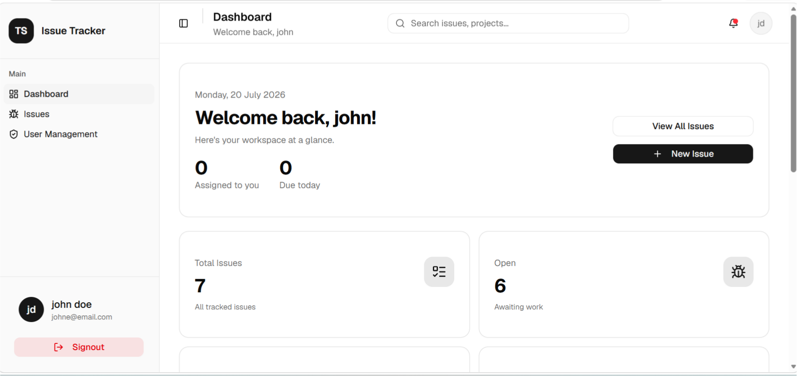
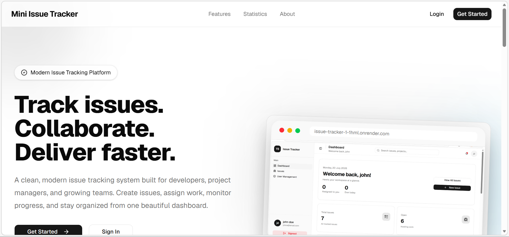
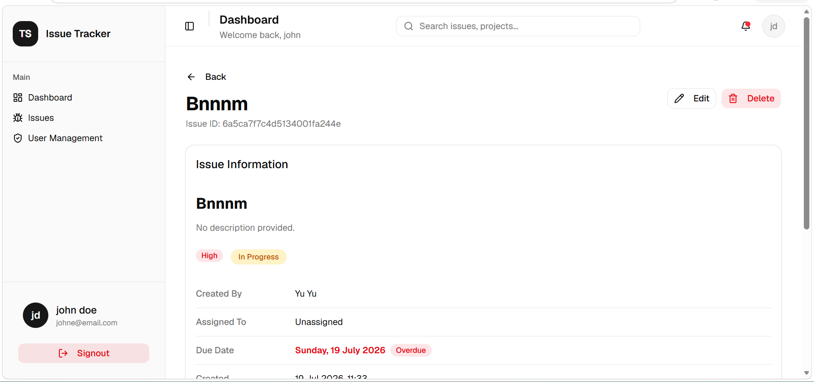
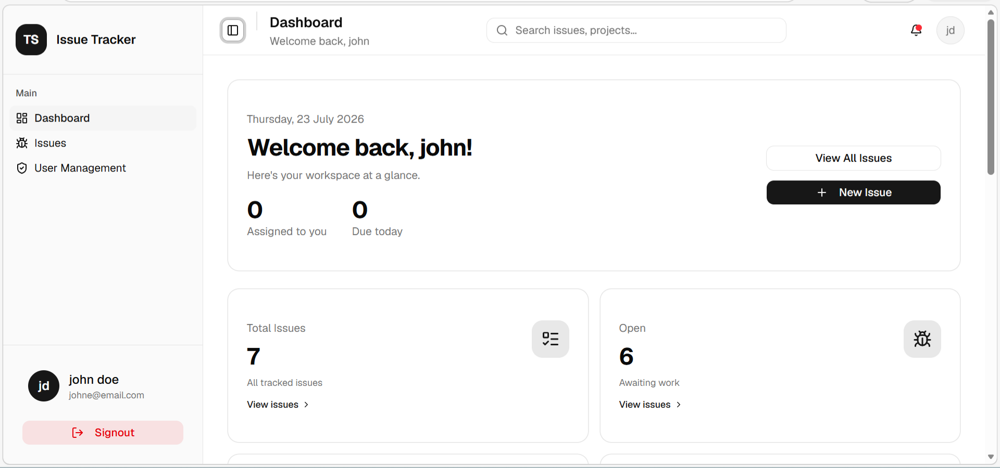
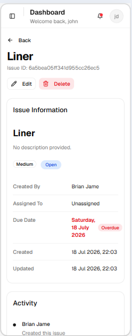

# Mini Issue Tracking System

A modern full-stack issue tracking application built with **React**, **Node.js**, **Express**, and **MongoDB**. The system enables teams to create, assign, prioritize, monitor, and resolve issues through a responsive interface backed by a secure REST API and real-time updates.

Developed as part of a Full Stack Technical Assessment, the application demonstrates modern software engineering practices, including layered backend architecture, feature-based frontend organization, JWT authentication, role-based authorization, optimistic UI updates, activity logging, Docker containerization, and responsive user interface design.

---

## Live Demo

| Service | URL |
|---------|-----|
| Frontend | https://issue-tracker-1-1hml.onrender.com |
| Backend API | https://issue-tracker-2shr.onrender.com |
| Swagger Documentation | https://issue-tracker-2shr.onrender.com/api/docs |

---

## Demo Video

A complete walkthrough of the application is available below.

[](https://youtu.be/atkTEycp-VA)

---

## Project Preview

### Landing Page

The application opens with a responsive landing page introducing the platform, highlighting its core capabilities, technology stack, and providing direct access to authentication.



---

### Login

Secure authentication using JWT stored in HTTP-only cookies.


---

### Register

New users can create an account through a validated registration workflow.


---

### Dashboard

The dashboard presents high-level project statistics, recent activity, and quick navigation to issue management.


---

### Issue Management

Browse, search, filter, sort, create, edit, and manage issues from a unified interface.



---

### Issue Details

Each issue includes a dedicated details page displaying metadata, assignment information, activity history, and management actions.



---

### Profile

Authenticated users can view and manage their personal profile information.


---

### User Administration

Administrators have access to a dedicated user management interface.


---

### Mobile Experience

The application is fully responsive across desktop, tablet, and mobile devices.



---

### Docker Deployment

The application supports containerized deployment using Docker and Docker Compose.


---

# Table of Contents

1. Project Overview
2. Project Objectives
3. Features
4. Technology Stack
5. System Architecture
6. Application Structure
7. Database Design
8. Backend Design
9. Frontend Design
10. Authentication & Authorization
11. REST API
12. Real-Time Updates
13. Performance Optimizations
14. Security Considerations
15. Docker Support
16. Local Development
17. Deployment
18. Engineering Decisions
19. Challenges Encountered
20. Trade-offs
21. Future Improvements
22. Conclusion

# 1. Project Overview

## Background

Issue tracking systems play a vital role in modern software development by providing a centralized platform for managing bugs, feature requests, technical tasks, and project progress. As teams grow, maintaining visibility into ongoing work becomes increasingly important to ensure accountability, collaboration, and timely delivery.

The Mini Issue Tracking System was developed to provide a streamlined solution for managing software development tasks while demonstrating the implementation of modern full-stack engineering practices.

---

## Project Objective

The primary objective of this project is to design and implement a secure, scalable, and responsive issue tracking platform that enables authenticated users to create, manage, assign, and monitor issues throughout their lifecycle.

Beyond satisfying the functional requirements of the technical assessment, the project also emphasizes software quality through clean architecture, maintainable code organization, and production-oriented development practices.

---

## Scope

The application supports the complete issue management workflow, including:

- User registration and authentication
- Role-based authorization
- Dashboard analytics
- Issue creation and management
- Issue assignment
- Activity history tracking
- Profile management
- Administrative user management
- Search, filtering, sorting, and pagination
- Responsive user experience
- Real-time issue updates
- API documentation
- Dockerized deployment

---

## Intended Users

The system is designed for environments where issue tracking and task management are required, including:

- Software development teams
- Individual developers
- Student project teams
- Small engineering organizations
- Academic demonstrations
- Technical assessments

---

## Key Capabilities

The completed application provides the following capabilities:

- Secure JWT-based authentication using HTTP-only cookies
- Role-based access control for administrative operations
- Interactive dashboard with issue statistics and recent activity
- Complete Create, Read, Update, and Delete (CRUD) operations for issues
- Advanced issue search with debounced input
- Filtering by status and priority
- Server-side pagination and sorting
- Activity history for issue modifications
- Optimistic UI updates for improved responsiveness
- Real-time synchronization using WebSockets
- Fully responsive interface supporting desktop, tablet, and mobile devices
- Interactive API documentation using Swagger/OpenAPI
- Docker and Docker Compose support for containerized deployment

---

## Functional Modules

The application is organized into several core modules:

| Module | Purpose |
|---------|---------|
| Landing Page | Product introduction and application entry point |
| Authentication | User registration, login, logout, and session management |
| Dashboard | Overview statistics, recent issues, and quick navigation |
| Issue Management | Complete issue lifecycle management |
| Profile | User profile information and account management |
| Administration | Administrative user management and role control |
| Activity History | Audit trail for issue updates |
| REST API | Backend services consumed by the frontend |
| Real-Time Service | Live synchronization of issue updates |

---

## Design Goals

Several engineering goals guided the implementation of the project:

- Maintain a clean separation between frontend and backend responsibilities.
- Follow modular and scalable project structures.
- Prioritize readability and maintainability over unnecessary complexity.
- Build a responsive interface that provides a consistent experience across devices.
- Adopt modern development practices and tooling suitable for production environments.
- Keep the application extensible for future enhancements.

---

## Project Outcome

The final solution demonstrates a complete full-stack web application that combines a modern React frontend with a RESTful Express backend, persistent MongoDB storage, secure authentication, real-time communication, and containerized deployment.

The implementation not only satisfies the functional requirements of the assessment but also incorporates several production-oriented enhancements—including Docker support, optimistic updates, Swagger documentation, activity logging, responsive design, and role-based authorization—to create a more comprehensive and maintainable application.

# 2. Features

The Mini Issue Tracking System provides a complete issue management workflow through a modern web interface backed by a secure RESTful API. The application was developed with a focus on usability, maintainability, and production-ready engineering practices.

The following sections summarize the major capabilities implemented throughout the system.

---

## Landing Page

The application includes a dedicated landing page that serves as the public entry point for unauthenticated users.

Features include:

- Modern responsive hero section
- Product overview
- Feature highlights
- Technology showcase
- Project statistics
- Direct navigation to Login and Registration pages
- Mobile-first responsive design

---

## User Authentication

Authentication is implemented using JSON Web Tokens (JWT) stored in HTTP-only cookies, providing secure session management while protecting tokens from client-side JavaScript access.

Implemented functionality includes:

- User registration
- User login
- Secure logout
- Persistent authentication
- Protected application routes
- Session validation
- Automatic unauthorized request handling

---

## Role-Based Authorization

The application distinguishes between standard users and administrators using Role-Based Access Control (RBAC).

### User Capabilities

Authenticated users can:

- Create issues
- View issues
- Edit issues
- Delete issues
- View issue history
- Manage their profile
- Access the dashboard

### Administrator Capabilities

Administrators inherit all user permissions and additionally have access to:

- User management
- Administrative pages
- Role-specific functionality

---

## Dashboard

The dashboard provides an overview of the current workspace through visual summaries and quick navigation.

Key functionality includes:

- Total issue statistics
- Open issue count
- In-progress issue count
- Resolved issue count
- Recent issues list
- Quick navigation cards
- Interactive dashboard widgets

Dashboard statistic cards are clickable and automatically navigate users to filtered issue views for faster workflow.

---

## Issue Management

The issue management module forms the core of the application.

Supported operations include:

- Create new issues
- View issue details
- Edit existing issues
- Delete issues
- Assign issues
- Update issue status
- Set issue priority
- Configure due dates

Each issue maintains its own lifecycle and activity history.

---

## Advanced Search and Filtering

To improve productivity when managing larger datasets, the issue list includes several filtering and sorting capabilities.

Implemented features include:

- Debounced text search
- Status filtering
- Priority filtering
- Server-side sorting
- Server-side pagination
- Automatic page reset when filters change

The debounced search implementation reduces unnecessary API requests while maintaining a responsive user experience.

---

## Activity History

Every significant modification to an issue is recorded within an activity log.

Tracked events include:

- Issue creation
- Updates
- Status changes
- Assignment changes
- Priority changes

This provides an audit trail that improves accountability and transparency.

---

## User Profile

Each authenticated user has access to a dedicated profile page where account information can be viewed and managed.

The profile module centralizes user-related information while maintaining a clean separation from issue management functionality.

---

## Administrative User Management

Administrators can access a dedicated interface for managing registered users.

This module demonstrates the implementation of role-based authorization within the frontend and backend while separating privileged operations from standard user functionality.

---

## Responsive User Interface

The interface was designed using a mobile-first approach and adapts to multiple screen sizes.

Supported layouts include:

- Desktop
- Laptop
- Tablet
- Mobile

Responsive behavior extends across all major application pages, including authentication, dashboard, profile management, and issue management.

---

## Real-Time Updates

Socket.IO is integrated into the backend to support real-time communication.

Whenever an issue is modified, connected clients receive updates without requiring a manual refresh, ensuring users always view the latest project state.

---

## Swagger API Documentation

Interactive API documentation is generated using Swagger/OpenAPI.

The documentation enables developers to:

- Explore available endpoints
- Inspect request and response schemas
- Test API operations directly from the browser

---

## Docker Support

The application supports containerized deployment using Docker and Docker Compose.

Containerization simplifies local development by providing a consistent runtime environment for both the frontend and backend while reducing machine-specific configuration issues.

---

## Optimistic User Experience

Several frontend enhancements improve the overall user experience, including:

- Optimistic UI updates
- Loading indicators
- Error handling
- Toast notifications
- Debounced search
- Interactive navigation
- Responsive layouts
- Smooth page transitions

These improvements create a more responsive and intuitive application while minimizing perceived latency during server communication.

# 3. Technology Stack

The Mini Issue Tracking System was developed using a modern JavaScript technology stack selected for maintainability, scalability, developer productivity, and community support. The technologies used throughout the project complement one another to provide a cohesive full-stack development experience.

---

## Frontend Technologies

The frontend is built as a Single Page Application (SPA) using React and modern frontend tooling.

| Technology | Purpose |
|------------|---------|
| React | Component-based user interface development |
| Vite | Fast development server and production build tool |
| React Router | Client-side routing and navigation |
| TanStack Query (React Query) | Server state management, caching, and data synchronization |
| Axios | HTTP client for API communication |
| Tailwind CSS | Utility-first styling framework |
| shadcn/ui | Accessible, reusable UI component library |
| Lucide React | Icon library |
| React Hook Form | Form management |
| Zod | Client-side schema validation |
| Sonner | Toast notifications |

---

## Backend Technologies

The backend exposes a RESTful API responsible for authentication, business logic, data validation, and persistence.

| Technology | Purpose |
|------------|---------|
| Node.js | JavaScript runtime |
| Express.js | Web application framework |
| MongoDB Atlas | Cloud-hosted NoSQL database |
| Mongoose | MongoDB object modeling |
| JWT | Authentication and authorization |
| Socket.IO | Real-time communication |
| Swagger/OpenAPI | Interactive API documentation |
| Helmet | HTTP security headers |
| CORS | Cross-Origin Resource Sharing configuration |
| dotenv | Environment variable management |

---

## Development Tools

The following tools were used to improve development workflow and maintain code quality.

| Tool | Purpose |
|------|---------|
| Docker | Application containerization |
| Docker Compose | Multi-container orchestration |
| Git | Version control |
| GitHub | Source code hosting |
| Render | Application deployment |
| npm | Dependency management |
| ESLint | Static code analysis |
| Prettier | Code formatting |
| Jest | Backend unit testing |
| Supertest | API endpoint testing |

---

## Why This Stack?

The selected technologies were chosen to balance developer productivity with production readiness.

### React

React enables the construction of reusable, composable UI components while maintaining a clear separation of concerns. Its component-driven architecture simplified the development of independent feature modules such as authentication, dashboard, issues, profile management, and administration.

---

### Vite

Vite provides significantly faster development startup times and build performance compared to traditional bundlers, improving the overall development experience.

---

### Express

Express offers a lightweight yet flexible foundation for building RESTful APIs. Its middleware architecture made it straightforward to integrate authentication, validation, logging, error handling, and API documentation.

---

### MongoDB

MongoDB was selected for its flexible document-oriented model, which naturally represents users, issues, and activity logs without requiring complex relational mappings.

---

### Mongoose

Mongoose provides schema validation, middleware support, relationship handling, and convenient query APIs while maintaining consistency across database operations.

---

### TanStack Query

Rather than manually managing asynchronous state, TanStack Query handles:

- Request caching
- Background refetching
- Automatic loading states
- Error handling
- Cache invalidation
- Optimistic UI updates

This significantly reduces frontend complexity.

---

### Tailwind CSS

Tailwind CSS enables rapid interface development while maintaining consistent spacing, typography, color usage, and responsive layouts throughout the application.

---

### shadcn/ui

The component library provides accessible, customizable building blocks that integrate seamlessly with Tailwind CSS, reducing the need to develop common UI elements from scratch.

---

### Docker

Docker ensures consistent application behavior across development and deployment environments by encapsulating dependencies and runtime configuration within isolated containers.

Using Docker Compose further simplifies local setup by orchestrating the frontend and backend services together.

---

## Application Architecture Overview

The technology stack is organized into distinct layers.

```text
                React + Vite
                     │
      React Query • Axios • React Router
                     │
               REST API / Socket.IO
                     │
             Express.js Application
                     │
      Authentication • Validation • Services
                     │
                 Mongoose ODM
                     │
               MongoDB Atlas
```

This layered architecture promotes modularity, simplifies maintenance, and allows the frontend and backend to evolve independently while communicating through a well-defined REST API.

# 4. System Architecture

The Mini Issue Tracking System adopts a modular client-server architecture that separates presentation, business logic, and data persistence into independent layers. This design improves maintainability, scalability, and extensibility while allowing the frontend and backend to be developed and deployed independently.

The application communicates primarily through a RESTful API, with Socket.IO providing real-time updates for issue-related events.

---

## High-Level Architecture

```text
                   ┌──────────────────────────┐
                   │     React Frontend       │
                   │ (Vite + React Router)    │
                   └─────────────┬────────────┘
                                 │
                      HTTP / WebSocket Requests
                                 │
               ┌─────────────────▼─────────────────┐
               │         Express Backend           │
               │      REST API + Socket.IO         │
               └─────────────────┬─────────────────┘
                                 │
                  Authentication • Business Logic
                                 │
                         Mongoose ODM Layer
                                 │
               ┌─────────────────▼─────────────────┐
               │          MongoDB Atlas            │
               └───────────────────────────────────┘
```

The frontend is responsible for user interaction and presentation, while the backend manages authentication, validation, business logic, persistence, and real-time communication.

---

## Frontend Architecture

The frontend follows a **feature-based architecture**, where each major module owns its components, hooks, dialogs, utilities, and constants.

```text
src/
│
├── components/
├── features/
│   ├── auth/
│   ├── dashboard/
│   ├── issues/
│   ├── profile/
│   └── admin/
│
├── hooks/
├── layouts/
├── pages/
├── routes/
├── services/
└── utils/
```

This organization keeps related functionality together, reducing coupling and improving maintainability as the application grows.

---

## Backend Architecture

The backend follows a layered architecture that separates request handling from business logic and database operations.

```text
Incoming Request
        │
        ▼
     Express Route
        │
        ▼
    Middleware Layer
        │
        ▼
     Controller Layer
        │
        ▼
      Service Layer
        │
        ▼
     Mongoose Models
        │
        ▼
      MongoDB Atlas
```

Each layer has a clearly defined responsibility, reducing duplication and simplifying future enhancements.

---

## Request Lifecycle

Every client request follows the same processing pipeline.

```text
Client
   │
   ▼
Express Route
   │
Authentication
   │
Authorization
   │
Validation
   │
Controller
   │
Business Service
   │
Database
   │
Response
```

This consistent request flow makes debugging easier while ensuring that every request is authenticated, validated, and processed in a predictable manner.

---

## Module Overview

The application is organized into several independent functional modules.

| Module | Responsibility |
|---------|----------------|
| Landing | Public product presentation |
| Authentication | Login, registration, logout, session management |
| Dashboard | Statistics and workspace overview |
| Issues | Complete issue lifecycle management |
| Profile | User profile management |
| Administration | User administration and role management |
| Activity History | Issue audit trail |
| Real-Time Service | Live issue synchronization |

Each module is designed to operate independently while sharing common infrastructure such as authentication and API communication.

---

## API Communication

Communication between the frontend and backend occurs through RESTful endpoints using Axios.

The frontend delegates all HTTP requests to dedicated service modules, ensuring that UI components remain focused solely on rendering and user interaction.

Typical communication flow:

```text
React Component
       │
       ▼
Custom Hook
       │
       ▼
Service Layer
       │
       ▼
Axios Client
       │
       ▼
REST API
```

This abstraction simplifies testing and makes backend changes easier to accommodate.

---

## Real-Time Communication

Socket.IO complements the REST API by broadcasting issue updates to connected clients.

Real-time events include:

- Issue creation
- Issue updates
- Issue deletion

This ensures users receive immediate feedback without requiring manual page refreshes.

---

## State Management Strategy

The application separates **server state** from **client state**.

### Server State

Managed using TanStack Query.

Responsibilities include:

- Data fetching
- Caching
- Background synchronization
- Request deduplication
- Cache invalidation
- Optimistic updates

### Client State

Managed using React hooks.

Examples include:

- Search input
- Active filters
- Dialog visibility
- Form state
- Theme preferences
- Pagination controls

This separation minimizes unnecessary complexity while keeping application state predictable.

---

## Scalability Considerations

Several architectural decisions were made to support future expansion.

These include:

- Feature-based frontend organization
- Layered backend architecture
- Reusable UI components
- RESTful API design
- Dedicated service layer
- Modular routing
- Environment-based configuration
- Dockerized deployment

These decisions allow additional features to be introduced with minimal changes to the existing codebase.

---

## Architecture Benefits

The selected architecture provides several practical advantages:

- Clear separation of concerns
- High code reusability
- Easier debugging
- Improved maintainability
- Independent frontend and backend deployment
- Simplified testing
- Better scalability
- Production-ready project organization

Overall, the architecture provides a strong foundation for both the current application requirements and future enhancements.

# 5. Project Structure

The project follows a modular full-stack architecture with independent frontend and backend applications. This separation allows each application to evolve independently while communicating through a well-defined REST API.

```
Mini-Issue-Tracking-System/
│
├── backend/
│   ├── src/
│   │   ├── config/
│   │   ├── constants/
│   │   ├── controllers/
│   │   ├── middleware/
│   │   ├── models/
│   │   ├── routes/
│   │   ├── services/
│   │   ├── socket/
│   │   ├── swagger/
│   │   ├── utils/
│   │   ├── validators/
│   │   ├── app.js
│   │   └── server.js
│   │
│   ├── tests/
│   ├── Dockerfile
│   ├── package.json
│   └── .env.example
│
├── frontend/
│   ├── public/
│   ├── src/
│   │
│   │── assets/
│   │── components/
│   │── contexts/
│   │── features/
│   │── hooks/
│   │── layouts/
│   │── lib/
│   │── pages/
│   │── routes/
│   │── services/
│   │── styles/
│   │── utils/
│   │── App.jsx
│   │── main.jsx
│   │
│   ├── Dockerfile
│   ├── nginx.conf
│   ├── vite.config.js
│   └── package.json
│
├── docs/
│   ├── images/
│   └── demo-video.mp4
│
├── docker-compose.yml
├── LICENSE
└── README.md
```

---

## Backend Directory Overview

The backend is organized using a layered architecture where each directory has a single responsibility.

| Directory | Purpose |
|-----------|---------|
| **config/** | Database connection, environment configuration, and shared application settings |
| **constants/** | Enumerations, reusable messages, status values, and application constants |
| **controllers/** | Handle incoming HTTP requests and return API responses |
| **middleware/** | Authentication, authorization, validation, and error handling |
| **models/** | MongoDB schemas and data models |
| **routes/** | API endpoint definitions |
| **services/** | Business logic independent of request handling |
| **socket/** | Socket.IO initialization and event broadcasting |
| **swagger/** | OpenAPI documentation configuration |
| **utils/** | Helper utilities shared across modules |
| **validators/** | Zod validation schemas for incoming requests |

---

## Frontend Directory Overview

The frontend follows a feature-oriented structure that groups related functionality together.

| Directory | Purpose |
|-----------|---------|
| **assets/** | Images, icons, and static resources |
| **components/** | Reusable UI components |
| **contexts/** | Global React Context providers |
| **features/** | Self-contained feature modules (Issues, Authentication, etc.) |
| **hooks/** | Shared custom React hooks |
| **layouts/** | Shared application layouts |
| **lib/** | Shared libraries such as Axios configuration and utilities |
| **pages/** | Route-level page components |
| **routes/** | Protected, public, and application routing |
| **services/** | API communication layer |
| **styles/** | Global styling resources |
| **utils/** | Helper functions used across the frontend |

---

## Feature-Based Organization

Rather than grouping files solely by type, the application groups major functionality into feature modules.

Example:

```
features/
│
├── auth/
├── dashboard/
├── issues/
├── profile/
└── admin/
```

Each feature contains its own components, dialogs, hooks, constants, and utilities where appropriate. This reduces coupling between unrelated parts of the application and simplifies long-term maintenance.

---

## Separation of Responsibilities

The project intentionally separates responsibilities across multiple layers.

| Layer | Responsibility |
|--------|----------------|
| Pages | Route-level views |
| Components | User interface rendering |
| Hooks | State management and reusable logic |
| Services | API communication |
| Controllers | HTTP request handling |
| Business Services | Core application logic |
| Models | Database interaction |
| Validators | Request validation |

This separation improves readability, testing, and maintainability while reducing code duplication.

---

## Configuration Files

Several configuration files support development and deployment.

| File | Purpose |
|------|---------|
| `docker-compose.yml` | Multi-container orchestration |
| `frontend/nginx.conf` | Nginx reverse proxy configuration |
| `frontend/vite.config.js` | Vite configuration |
| `backend/.env.example` | Environment variable template |
| `frontend/Dockerfile` | Frontend container definition |
| `backend/Dockerfile` | Backend container definition |

---

## Documentation Assets

The `docs/` directory contains supplementary project materials used throughout this repository.

These include:

- Application screenshots
- Landing page preview
- Dashboard preview
- Mobile interface screenshots
- Demonstration video

These assets are referenced throughout this README to provide reviewers with a visual overview of the implemented system.

---

## Design Philosophy

The overall project structure emphasizes:

- Modularity
- Separation of concerns
- Reusability
- Scalability
- Consistency
- Ease of navigation

By organizing the application into clearly defined layers and feature modules, the codebase remains approachable for both new contributors and future maintenance.

# 6. Features

The Mini Issue Tracking System was designed to provide a complete issue management workflow while maintaining a clean, intuitive user experience. The application combines authentication, issue lifecycle management, dashboard analytics, responsive design, and modern UI practices into a single cohesive platform.

---

## Feature Overview

The implemented functionality can be grouped into the following categories:

| Category | Features |
|----------|----------|
| Authentication | Register, Login, Logout, Protected Routes |
| Dashboard | Workspace overview, statistics, recent issues |
| Issue Management | Create, View, Update, Delete issues |
| Search & Filtering | Search, status filter, priority filter, sorting |
| User Experience | Responsive layout, dark mode, optimistic updates |
| Administration | User roles and authorization |
| Real-Time | Live issue updates using Socket.IO |
| Documentation | Swagger/OpenAPI documentation |
| Deployment | Dockerized frontend and backend |

---

# 6.1 Landing Page

The application includes a dedicated landing page that serves as the public entry point for first-time visitors.

Unlike the authenticated dashboard, the landing page focuses on introducing the application, highlighting its capabilities, and encouraging users to register or sign in.

### Highlights

- Modern hero section
- Product introduction
- Feature showcase
- Statistics section
- Call-to-action section
- Responsive navigation
- Mobile-friendly layout
- Smooth scrolling navigation
- Animated dashboard preview

The landing page also demonstrates the application's overall visual identity before authentication.

---

# 6.2 Authentication

Authentication is implemented using **JSON Web Tokens (JWT)** stored securely in HTTP-only cookies.

Supported functionality includes:

- User registration
- User login
- Logout
- Protected routes
- Session persistence
- Automatic authentication checks
- Route guarding

Passwords are hashed before storage using bcrypt to ensure secure credential management.

---

# 6.3 Dashboard

After authentication, users are redirected to the dashboard.

The dashboard provides a concise overview of the current workspace and allows users to quickly understand project status.

Displayed information includes:

- Total issues
- Open issues
- Issues in progress
- Resolved issues
- Recent issues
- Assigned work summary
- Due today statistics

Interactive statistic cards allow users to navigate directly to filtered issue views.

---

# 6.4 Issue Management

The issue management module represents the core functionality of the application.

Users can perform complete CRUD operations on issues.

Supported operations include:

- Create new issue
- View issue details
- Edit issue
- Delete issue
- Assign users
- Update status
- Change priority
- Set due dates
- View activity history

Issue detail pages provide complete contextual information for each individual issue.

---

# 6.5 Search, Filtering, and Sorting

To improve usability, the issue list supports multiple filtering mechanisms.

Implemented features include:

- Keyword search
- Status filtering
- Priority filtering
- Sorting
- Pagination
- Debounced search input

Available sort options include:

- Newest
- Oldest
- Recently Updated
- Highest Priority

Debounced searching minimizes unnecessary API requests while maintaining a responsive user experience.

---

# 6.6 Recent Issues

The dashboard displays recently modified issues to help users quickly resume ongoing work.

Each recent issue displays:

- Issue title
- Current status
- Priority
- Assigned user
- Last updated date
- Overdue indicator

The issue identifier is intentionally omitted from dashboard cards to improve readability and reduce visual noise.

---

# 6.7 User Profile

Authenticated users have access to a dedicated profile page.

The profile interface allows users to view and manage their personal information.

Available functionality includes:

- View profile information
- Update profile details
- Display account information
- Responsive profile layout

This provides a centralized location for user-specific account management.

---

# 6.8 Role-Based Authorization

The application distinguishes between regular users and administrators.

Role-based authorization protects administrative functionality while allowing normal users to manage only their permitted resources.

Supported roles include:

- User
- Administrator

Authorization middleware validates permissions before protected endpoints are executed.

---

# 6.9 Real-Time Updates

Socket.IO is integrated to provide real-time synchronization between connected clients.

Whenever an issue is created, updated, or deleted, connected users receive immediate updates without refreshing the page.

This improves collaboration while maintaining data consistency across active sessions.

---

# 6.10 Responsive Design

The user interface has been designed using a mobile-first approach.

Layouts automatically adapt to different screen sizes including:

- Desktop
- Laptop
- Tablet
- Mobile devices

Responsive behavior has been implemented throughout the application, including navigation, dashboards, dialogs, issue lists, and forms.

---

# 6.11 Dark Mode

The application includes a fully integrated dark mode.

Theme switching updates all major interface components while preserving accessibility and readability.

Dark mode support includes:

- Landing page
- Dashboard
- Issue management pages
- Authentication pages
- Dialogs
- Navigation
- Cards
- Tables
- Forms

---

# 6.12 Optimistic UI Updates

To improve perceived performance, selected operations use optimistic updates.

Rather than waiting for the server response before updating the interface, the application immediately reflects user actions and synchronizes with the backend afterward.

Benefits include:

- Faster interactions
- Improved responsiveness
- Reduced perceived latency

---

# 6.13 Activity History

Every issue maintains an activity history that records significant modifications.

Examples include:

- Issue creation
- Status updates
- Priority changes
- Assignment changes
- General edits

This audit trail improves traceability and accountability throughout the issue lifecycle.

---

# 6.14 API Documentation

Interactive API documentation is provided through Swagger/OpenAPI.

Developers can explore available endpoints, inspect request and response formats, and test API operations directly from the browser.

Documentation includes:

- Authentication endpoints
- User endpoints
- Issue endpoints
- Activity endpoints

---

# 6.15 Docker Support

The application has been fully containerized using Docker.

Docker support includes:

- Backend container
- Frontend container
- Nginx reverse proxy
- Docker Compose orchestration

Containerization ensures a consistent runtime environment across development and deployment platforms.

---

## Feature Summary

The implemented feature set satisfies the functional requirements of the project while also incorporating several production-oriented enhancements, including role-based authorization, real-time communication, Docker support, optimistic updates, responsive design, and comprehensive API documentation.

# 7. Database Design

The Mini Issue Tracking System uses **MongoDB Atlas** as its primary database, with **Mongoose** serving as the Object Data Modeling (ODM) library. MongoDB was selected for its flexible document model, allowing the application to evolve without the rigid schema constraints associated with relational databases.

The database has been designed to maintain data consistency while supporting efficient querying, filtering, and future extensibility.

---

## Database Overview

The application stores data across three primary collections:

```text
MongoDB
│
├── Users
├── Issues
└── Activities
```

Each collection represents a distinct domain within the application and maintains clearly defined relationships with the others.

---

# Users Collection

The **Users** collection stores account information for every registered user.

Each document represents a single application user.

### Responsibilities

- Authentication
- Authorization
- Profile information
- Issue ownership
- Issue assignment

### Primary Fields

| Field | Description |
|---------|-------------|
| `_id` | Unique user identifier |
| `firstName` | User's first name |
| `lastName` | User's last name |
| `email` | Unique email address |
| `password` | Hashed password |
| `role` | User or Admin |
| `createdAt` | Creation timestamp |
| `updatedAt` | Last modification timestamp |

---

# Issues Collection

The **Issues** collection represents the central entity of the application.

Every issue progresses through its lifecycle while maintaining relationships with users and activity history.

### Primary Fields

| Field | Description |
|---------|-------------|
| `_id` | Unique issue identifier |
| `title` | Issue title |
| `description` | Detailed issue description |
| `status` | Current workflow status |
| `priority` | Issue priority |
| `assignee` | Assigned user |
| `createdBy` | Issue creator |
| `dueDate` | Expected completion date |
| `createdAt` | Creation timestamp |
| `updatedAt` | Last update timestamp |

---

### Supported Status Values

The issue lifecycle currently supports:

- Open
- In Progress
- Resolved

These values allow dashboard statistics, filtering, and workflow tracking.

---

### Supported Priority Levels

Issues can be classified according to urgency.

Supported values include:

- Low
- Medium
- High
- Critical

Priority is used throughout the application for sorting, filtering, and dashboard summaries.

---

# Activities Collection

Every significant issue modification generates an activity record.

Rather than overwriting historical information, the application maintains an audit trail that records important events throughout an issue's lifecycle.

### Recorded Events

Examples include:

- Issue created
- Status changed
- Priority updated
- Assignee changed
- Issue edited

This design improves traceability while providing users with historical context.

---

# Collection Relationships

Although MongoDB is document-oriented, logical relationships are maintained through document references.

```text
           User
            │
            │ createdBy
            │
            ▼
          Issue
            │
            │ assignee
            ▼
          User

Issue
  │
  │
  ▼
Activities
```

Each issue references:

- the user who created it
- the user currently assigned to it

Activities reference the issue they belong to, preserving a complete history of changes.

---

# Data Integrity

Several mechanisms are used to maintain data integrity throughout the application.

These include:

- Required fields
- Enumerated status values
- Enumerated priority values
- ObjectId references
- Backend validation using Zod
- Mongoose schema validation

Incoming requests are validated before reaching the database, reducing the likelihood of invalid or inconsistent data.

---

# Indexing Strategy

To improve query performance, indexes are applied to frequently queried fields.

Examples include:

- Status
- Priority
- Email
- Created date

These indexes improve the performance of:

- Dashboard statistics
- Filtering
- Sorting
- Search operations

---

# Database Design Considerations

Several design decisions influenced the database structure.

### Flexible Document Model

MongoDB's document-oriented approach allows the application to evolve without extensive schema migrations.

---

### Reference-Based Relationships

Instead of embedding complete user documents within issues, references are used to reduce duplication and simplify updates.

---

### Activity Logging

Separating activities into their own collection keeps issue documents lightweight while preserving a complete audit history.

---

### Scalability

The current schema supports future enhancements such as:

- Comments
- Attachments
- Labels
- Notifications
- Teams
- Projects
- Multiple workspaces

without requiring major structural changes.

---

## Database Summary

The database schema balances simplicity, performance, and extensibility. By combining MongoDB's flexible document model with Mongoose validation and logical document relationships, the application maintains data integrity while remaining adaptable to future feature additions.

# 9. REST API Documentation

The Mini Issue Tracking System exposes a RESTful API that serves as the communication layer between the frontend and backend. The API follows standard REST conventions, uses JSON for request and response bodies, and is documented using Swagger/OpenAPI.

All protected endpoints require authentication using a JWT stored in an HTTP-only cookie.

---

## Base URL

### Development

```text
http://localhost:5000/api
```

### Production

```text
https://issue-tracker-2shr.onrender.com/api
```

---

# Authentication

Authentication is cookie-based using JSON Web Tokens (JWT).

After a successful login, the backend returns a secure HTTP-only cookie that is automatically included in subsequent requests.

Protected routes validate this token before processing the request.

---

# Response Format

Successful responses follow a consistent structure.

```json
{
    "success": true,
    "message": "Operation completed successfully.",
    "data": {}
}
```

Error responses follow a similar format.

```json
{
    "success": false,
    "message": "Validation failed."
}
```

---

# Authentication Endpoints

## Register User

```http
POST /auth/register
```

Registers a new user account.

### Request Body

```json
{
    "firstName": "John",
    "lastName": "Doe",
    "email": "john@example.com",
    "password": "password123"
}
```

---

## Login

```http
POST /auth/login
```

Authenticates a user and issues a JWT cookie.

### Request Body

```json
{
    "email": "john@example.com",
    "password": "password123"
}
```

---

## Logout

```http
POST /auth/logout
```

Invalidates the current authentication session.

---

## Current User

```http
GET /auth/me
```

Returns information about the authenticated user.

Authentication required.

---

# Issue Endpoints

## Get All Issues

```http
GET /issues
```

Returns a paginated list of issues.

### Supported Query Parameters

| Parameter | Description |
|-----------|-------------|
| page | Page number |
| limit | Results per page |
| search | Search by title or description |
| status | Filter by status |
| priority | Filter by priority |
| sortBy | Field used for sorting |
| order | asc or desc |

Example:

```http
GET /issues?page=1&limit=10&status=Open&priority=High
```

---

## Get Single Issue

```http
GET /issues/:id
```

Returns detailed information about a specific issue.

Authentication required.

---

## Create Issue

```http
POST /issues
```

Creates a new issue.

### Request Body

```json
{
    "title": "Login page error",
    "description": "Users cannot log in after deployment.",
    "priority": "High",
    "status": "Open",
    "assignee": "USER_ID",
    "dueDate": "2026-08-01"
}
```

Authentication required.

---

## Update Issue

```http
PATCH /issues/:id
```

Updates an existing issue.

Only supplied fields are modified.

Authentication required.

---

## Delete Issue

```http
DELETE /issues/:id
```

Deletes an issue.

Authentication required.

---

# Activity Endpoints

## Get Issue Activity

```http
GET /issues/:id/activities
```

Returns the activity history associated with a specific issue.

Authentication required.

---

# Dashboard Endpoints

## Dashboard Statistics

```http
GET /issues/stats
```

Returns summary statistics used by the dashboard.

Example response:

```json
{
    "total": 42,
    "open": 12,
    "inProgress": 8,
    "resolved": 22,
    "assignedToMe": 5,
    "dueToday": 2
}
```

Authentication required.

---

# Profile Endpoints

## View Profile

```http
GET /users/profile
```

Returns the authenticated user's profile information.

Authentication required.

---

## Update Profile

```http
PATCH /users/profile
```

Updates editable profile information.

Authentication required.

---

# Authorization

Endpoints requiring authentication validate the JWT stored in the HTTP-only cookie before processing the request.

Certain operations are further protected using role-based authorization, ensuring that administrative functionality is accessible only to authorized users.

---

# Validation

Incoming requests are validated using **Zod** schemas before reaching the service layer.

Validation includes:

- Required fields
- Email format
- Password constraints
- Enum validation
- ObjectId validation
- Date validation

Invalid requests receive an appropriate `400 Bad Request` response with descriptive validation messages.

---

# Interactive API Documentation

The complete API specification is available through Swagger/OpenAPI.

Production:

```text
https://issue-tracker-2shr.onrender.com/api/docs
```

The interactive documentation allows developers to:

- Browse available endpoints
- Inspect request schemas
- View response models
- Test API operations directly from the browser
- Explore authentication requirements

---

## API Summary

The REST API provides a consistent, secure, and well-documented interface for all application functionality. By combining JWT authentication, request validation, standardized responses, and comprehensive Swagger documentation, the API is designed to be both developer-friendly and production-ready.

# 10. Frontend Architecture

The frontend of the Mini Issue Tracking System is built using **React** and **Vite**, providing a fast, modern, and component-driven user interface. The architecture emphasizes modularity, maintainability, and scalability through feature-based organization and reusable UI components.

---

## Technology Stack

The frontend is built using the following technologies:

| Technology | Purpose |
|------------|---------|
| React | Component-based UI development |
| Vite | Build tool and development server |
| React Router | Client-side routing |
| TanStack Query | Server state management |
| Axios | HTTP client |
| Tailwind CSS | Utility-first styling |
| shadcn/ui | Reusable UI component library |
| Lucide React | Icon library |
| Socket.IO Client | Real-time communication |

---

# Project Structure

The frontend follows a modular directory structure that separates reusable components, pages, hooks, services, and feature-specific logic.

```text
src
│
├── api
├── assets
├── components
│   ├── dashboard
│   ├── landing
│   ├── layout
│   └── ui
│
├── context
├── features
│   └── issues
│
├── hooks
├── layouts
├── lib
├── pages
├── routes
├── schemas
├── services
└── utils
```

This organization minimizes coupling between modules while making the application easier to extend.

---

# Routing

Routing is managed using **React Router**.

The application distinguishes between public and protected routes.

### Public Routes

- Landing Page
- Login
- Register

### Protected Routes

- Dashboard
- Issues
- Issue Details
- Profile

Protected routes require successful authentication before rendering.

---

# Authentication Flow

Authentication state is managed using a dedicated context provider.

The authentication workflow consists of:

1. User logs in.
2. Backend validates credentials.
3. JWT is stored in an HTTP-only cookie.
4. Frontend requests the authenticated user.
5. Authentication context updates the application state.
6. Protected routes become accessible.

This approach avoids storing authentication tokens in local storage, improving application security.

---

# State Management

The frontend distinguishes between local UI state and server state.

### Local State

React hooks manage:

- Dialog visibility
- Form inputs
- Theme selection
- UI interactions

### Server State

TanStack Query manages:

- API requests
- Data caching
- Background refetching
- Loading states
- Error states
- Cache invalidation

This separation keeps the application predictable and reduces unnecessary network requests.

---

# API Layer

All HTTP communication is centralized using Axios.

A shared Axios instance defines:

- Base URL
- JSON headers
- Credential handling
- Common configuration

Feature-specific service modules encapsulate API requests, ensuring components remain focused on presentation rather than networking logic.

---

# Component Architecture

The user interface is composed of reusable components.

Examples include:

- Buttons
- Cards
- Dialogs
- Forms
- Badges
- Tables
- Navigation
- Statistics cards
- Issue cards

This promotes consistency throughout the application and simplifies maintenance.

---

# Feature-Based Organization

Larger application functionality is organized into feature modules.

For example, the Issue module contains:

- Components
- Hooks
- Dialogs
- Constants
- Utilities

Grouping related functionality improves discoverability and reduces dependencies across unrelated parts of the application.

---

# Dashboard Design

The dashboard serves as the primary workspace after authentication.

Major sections include:

- Welcome banner
- Statistics cards
- Recent issues
- Navigation shortcuts

Interactive statistic cards allow users to navigate directly to filtered issue lists, improving workflow efficiency.

---

# Landing Page

The application includes a responsive landing page designed to introduce the system before authentication.

Key sections include:

- Hero section
- Product overview
- Feature highlights
- Statistics
- Call-to-action
- Footer

Additional enhancements include:

- Subtle gradient background
- Animated dashboard preview
- Smooth scrolling navigation
- Responsive mobile layout
- Technology badge highlighting React, Express, and MongoDB

---

# Responsive Design

The interface was designed using a mobile-first approach.

Layouts adapt automatically for:

- Mobile phones
- Tablets
- Laptops
- Desktop monitors

Responsive behavior is implemented consistently across pages, forms, dialogs, navigation, and dashboards.

---

# Dark Mode

The application supports light and dark themes.

Theme support extends to:

- Landing page
- Dashboard
- Issue pages
- Authentication pages
- Forms
- Dialogs
- Navigation
- Cards

The design maintains accessibility and visual consistency across both themes.

---

# User Experience Enhancements

Several features were implemented to improve usability and responsiveness.

These include:

- Debounced search
- Optimistic UI updates
- Loading indicators
- Empty states
- Hover animations
- Smooth transitions
- Clickable dashboard statistics
- Clickable recent issue cards
- Responsive dialogs

Together, these enhancements create a more fluid and engaging user experience.

---

## Frontend Summary

The frontend architecture combines modern React development practices with reusable components, feature-based organization, efficient state management, and responsive design. This structure supports maintainability, scalability, and a polished user experience while remaining easy for future developers to extend.

# 11. Backend Architecture

The backend of the Mini Issue Tracking System is built using **Node.js**, **Express.js**, and **MongoDB**, following a layered architecture that separates routing, business logic, validation, data access, and persistence. This structure improves maintainability, promotes code reuse, and simplifies future feature development.

---

## Technology Stack

The backend leverages the following technologies:

| Technology | Purpose |
|------------|---------|
| Node.js | JavaScript runtime |
| Express.js | Web framework |
| MongoDB Atlas | NoSQL database |
| Mongoose | Object Data Modeling (ODM) |
| Zod | Request validation |
| JWT | Authentication |
| bcrypt | Password hashing |
| Socket.IO | Real-time communication |
| Swagger | API documentation |

---

# Architecture Overview

The backend follows a layered architecture that separates responsibilities across multiple components.

```text
                Client
                   │
                   ▼
             Express Router
                   │
                   ▼
              Middleware
                   │
                   ▼
             Controller Layer
                   │
                   ▼
              Service Layer
                   │
                   ▼
             Database Layer
                   │
                   ▼
               MongoDB Atlas
```

Each layer performs a single responsibility, reducing coupling and improving testability.

---

# Directory Structure

The backend is organized into dedicated modules.

```text
backend
│
├── src
│   ├── config
│   ├── controllers
│   ├── middlewares
│   ├── models
│   ├── routes
│   ├── services
│   ├── socket
│   ├── swagger
│   ├── utils
│   ├── validators
│   ├── app.js
│   └── server.js
│
├── tests
├── Dockerfile
└── package.json
```

Each folder groups related functionality, making the project easier to navigate and extend.

---

# Request Lifecycle

Every incoming request follows a consistent execution flow.

```text
Client Request

        │

        ▼

Express Router

        │

        ▼

Authentication Middleware

        │

        ▼

Validation Middleware

        │

        ▼

Controller

        │

        ▼

Service

        │

        ▼

MongoDB

        │

        ▼

JSON Response
```

This layered flow ensures validation and authorization occur before business logic is executed.

---

# Controllers

Controllers act as the entry point for HTTP requests.

Their responsibilities include:

- Receiving requests
- Extracting request data
- Invoking service methods
- Returning HTTP responses

Controllers intentionally avoid business logic, delegating processing to the service layer.

---

# Services

The service layer contains the application's core business logic.

Examples include:

- Creating issues
- Updating issue status
- User authentication
- Dashboard statistics
- Activity logging
- Profile management

Keeping business logic centralized improves maintainability and reduces duplication.

---

# Models

Mongoose models define the structure of application data.

Primary models include:

- User
- Issue
- Activity

Each model includes schema definitions, validation rules, relationships, timestamps, and indexes where appropriate.

---

# Validation

Incoming requests are validated using **Zod** before reaching the controller layer.

Validation covers:

- Required fields
- Email format
- Password rules
- Enum values
- ObjectId format
- Date validation

Invalid requests are rejected immediately with descriptive error messages.

---

# Authentication

Authentication is implemented using **JSON Web Tokens (JWT)**.

The authentication process consists of:

1. User submits credentials.
2. Password is verified using bcrypt.
3. JWT is generated.
4. Token is stored in an HTTP-only cookie.
5. Protected routes validate the cookie before allowing access.

This approach improves security by preventing client-side access to authentication tokens.

---

# Authorization

The application supports role-based authorization.

Current roles include:

- User
- Admin

Authorization middleware restricts sensitive operations based on the authenticated user's role.

---

# Activity Logging

Every important issue modification automatically generates an activity record.

Examples include:

- Issue created
- Status updated
- Priority changed
- Assignee changed
- Issue edited

This audit trail provides accountability and improves issue traceability.

---

# Error Handling

The backend follows a centralized error handling strategy.

Errors are categorized into:

- Validation errors
- Authentication errors
- Authorization errors
- Database errors
- Resource not found
- Internal server errors

Clients receive consistent JSON responses regardless of the error source.

---

# Security

Multiple security measures have been implemented.

These include:

- Password hashing using bcrypt
- HTTP-only authentication cookies
- JWT verification
- Input validation
- Protected routes
- Role-based authorization
- Secure HTTP headers via Helmet
- CORS configuration

Together, these measures help protect the application against common web vulnerabilities.

---

# Real-Time Communication

Socket.IO is integrated into the backend to support real-time updates.

When an issue is modified, connected clients receive immediate notifications without requiring a page refresh.

Real-time events currently include:

- Issue creation
- Issue updates
- Issue deletion

This improves collaboration and ensures users always see current project data.

---

# API Documentation

The backend automatically generates interactive API documentation using Swagger/OpenAPI.

Developers can:

- Explore endpoints
- Inspect schemas
- Test requests
- Review authentication requirements

This significantly improves onboarding and API usability.

---

# Docker Support

The backend is fully containerized using Docker.

Containerization provides:

- Consistent development environments
- Simplified deployment
- Dependency isolation
- Platform independence

Docker Compose orchestrates both frontend and backend services, enabling the complete application to run with a single command.

---

## Backend Summary

The backend architecture emphasizes modularity, security, and maintainability. By separating routing, validation, business logic, and persistence into dedicated layers, the application remains scalable and easy to extend while supporting secure authentication, real-time communication, comprehensive API documentation, and containerized deployment.

# 12. Database Design

The Mini Issue Tracking System uses **MongoDB Atlas** as its primary database, with **Mongoose** serving as the Object Data Modeling (ODM) library. The database schema was designed to provide flexibility while maintaining clear relationships between users, issues, and activity logs.

---

## Database Technology

| Technology | Purpose |
|------------|---------|
| MongoDB Atlas | Cloud-hosted NoSQL database |
| Mongoose | Schema definition and data modeling |
| BSON | Native document storage format |

---

# Database Overview

The application stores its data across three primary collections.

```text
Users
   │
   │ creates
   ▼
Issues
   │
   │ generates
   ▼
Activities
```

This structure separates authentication, issue management, and audit history into independent collections while maintaining references between them.

---

# Collections

The database consists of the following collections:

- Users
- Issues
- Activities

Each collection is responsible for a single domain within the application.

---

# User Collection

The **Users** collection stores authentication and profile information.

### Main Fields

| Field | Description |
|--------|-------------|
| _id | MongoDB ObjectId |
| firstName | User first name |
| lastName | User last name |
| email | Unique email address |
| password | Hashed password |
| role | User or Admin |
| avatar | Profile image (optional) |
| createdAt | Record creation timestamp |
| updatedAt | Last modification timestamp |

---

# Issue Collection

The **Issues** collection represents every tracked issue within the system.

### Main Fields

| Field | Description |
|--------|-------------|
| _id | MongoDB ObjectId |
| title | Issue title |
| description | Detailed description |
| status | Current workflow state |
| priority | Issue priority |
| assignee | Referenced User |
| createdBy | Referenced User |
| dueDate | Optional deadline |
| createdAt | Creation timestamp |
| updatedAt | Last modification timestamp |

---

# Activity Collection

The **Activities** collection stores the audit history for issues.

Each record represents a significant action performed on an issue.

### Main Fields

| Field | Description |
|--------|-------------|
| _id | MongoDB ObjectId |
| issue | Referenced Issue |
| user | User performing the action |
| action | Action performed |
| description | Human-readable activity description |
| createdAt | Timestamp |

---

# Entity Relationships

Although MongoDB is a document database, the application models relationships using ObjectId references.

```text
User

 ├──────────────┐
 │              │
 │              │
 ▼              ▼

Issues      Activities

        ▲
        │
        │
      Issue
```

Relationships include:

- One user can create many issues.
- One user can be assigned many issues.
- One issue can have many activity records.
- One activity belongs to exactly one issue.

---

# Issue Status Values

Issues move through predefined workflow states.

```text
Open

↓

In Progress

↓

Resolved
```

These values are enforced using schema validation.

---

# Priority Levels

Each issue is assigned one priority level.

```text
Low

Medium

High

Critical
```

Priority values are validated before persistence.

---

# Indexing Strategy

Indexes are applied to improve query performance.

Primary indexes include:

- Email
- Status
- Priority
- Created date

These indexes accelerate filtering, searching, sorting, and authentication operations.

---

# Data Validation

Mongoose schemas enforce structural validation before data reaches the database.

Validation includes:

- Required fields
- Enum constraints
- ObjectId references
- String lengths
- Unique email addresses
- Default values

Application-level validation is performed earlier using Zod, providing two layers of protection.

---

# Timestamps

All primary collections automatically maintain timestamps.

```text
createdAt

updatedAt
```

These timestamps support:

- Sorting
- Dashboard statistics
- Activity history
- Audit tracking

---

# Normalization Strategy

The database balances normalization with MongoDB's document-oriented design.

Instead of embedding large user objects within issues, ObjectId references are used.

Benefits include:

- Reduced duplication
- Easier updates
- Smaller documents
- Improved maintainability

---

# Example Relationship

A simplified example illustrates how collections relate.

```text
User

John Doe

│

├── Issue A

├── Issue B

└── Issue C


Issue B

│

├── Created

├── Assigned

├── Priority Updated

└── Resolved
```

This relationship enables complete issue history while avoiding duplicated user data.

---

# Scalability Considerations

The schema was designed to support future enhancements without requiring significant structural changes.

Potential future extensions include:

- Comments
- File attachments
- Labels
- Notifications
- Projects
- Teams
- Issue categories
- Watchers

These features can be added through additional collections and references while preserving the existing schema.

---

## Database Summary

The MongoDB schema provides a clean and extensible foundation for the Mini Issue Tracking System. By separating users, issues, and activity logs into dedicated collections connected through ObjectId references, the design supports efficient querying, strong data integrity, auditability, and future scalability while remaining simple to maintain.

# 13. Authentication & Authorization

Authentication and authorization form the security foundation of the Mini Issue Tracking System. The application implements secure user authentication using **JSON Web Tokens (JWT)** stored inside **HTTP-only cookies**, together with **role-based authorization** to protect sensitive resources.

---

## Authentication Overview

The authentication system verifies user identity before allowing access to protected resources.

Authentication supports:

- User Registration
- User Login
- Secure Logout
- Session Persistence
- Current User Retrieval

The frontend and backend communicate using secure cookies rather than storing access tokens in browser storage.

---

# Authentication Workflow

The login process follows the sequence below.

```text
User

│

▼

Login Form

│

▼

POST /api/auth/login

│

▼

Validate Credentials

│

▼

Compare Password (bcrypt)

│

▼

Generate JWT

│

▼

Store JWT in HTTP-only Cookie

│

▼

Authenticated Session
```

Once authenticated, every protected request automatically includes the cookie.

---

# Registration Flow

New users register by providing:

- First Name
- Last Name
- Email Address
- Password

Registration includes several validation steps.

1. Validate input using Zod.
2. Check for duplicate email addresses.
3. Hash password using bcrypt.
4. Create new user.
5. Generate authentication cookie.
6. Return authenticated user.

This provides a seamless onboarding experience.

---

# Login Flow

During login, the backend performs the following operations.

```text
Receive Credentials

↓

Validate Input

↓

Locate User

↓

Compare Password

↓

Generate JWT

↓

Set HTTP-only Cookie

↓

Return User Information
```

Passwords are never stored or transmitted in plain text.

---

# Password Security

Passwords are hashed using **bcrypt** before storage.

Benefits include:

- One-way hashing
- Salt generation
- Protection against rainbow table attacks
- Industry-standard password security

Only hashed passwords are stored inside MongoDB.

---

# JWT Authentication

After successful authentication, the backend generates a signed JSON Web Token.

The token contains:

- User ID
- User Role
- Expiration Time

The JWT is verified for every protected request.

---

# Cookie Configuration

Authentication tokens are stored inside secure cookies.

Typical configuration includes:

| Setting | Purpose |
|----------|---------|
| httpOnly | Prevent JavaScript access |
| sameSite | CSRF protection |
| secure | HTTPS-only in production |
| maxAge | Session expiration |

Using cookies significantly reduces exposure to client-side attacks compared to local storage.

---

# Protected Routes

Certain frontend pages require authentication.

Protected routes include:

- Dashboard
- Issues
- Issue Details
- Profile

Unauthenticated users attempting to access these pages are redirected to the login screen.

---

# Authorization

After authentication, authorization determines what actions a user may perform.

Current roles include:

```text
User

Admin
```

Authorization middleware evaluates the authenticated user's role before executing protected operations.

---

# Role-Based Permissions

Current permissions are summarized below.

| Feature | User | Admin |
|----------|------|-------|
| View Issues | ✓ | ✓ |
| Create Issues | ✓ | ✓ |
| Update Assigned Issues | ✓ | ✓ |
| Delete Issues | ✓* | ✓ |
| Manage Users | ✗ | ✓ |

*Subject to ownership and application rules.

This model can easily be extended with additional roles in future releases.

---

# Authentication Middleware

Every protected API endpoint passes through authentication middleware.

Responsibilities include:

- Reading authentication cookie
- Verifying JWT signature
- Extracting user information
- Attaching authenticated user to the request
- Rejecting invalid sessions

Controllers therefore receive trusted user information without additional authentication logic.

---

# Authorization Middleware

Authorization middleware verifies whether an authenticated user has permission to perform the requested operation.

Typical checks include:

- User role
- Resource ownership
- Administrative privileges

Unauthorized requests receive an appropriate HTTP error response.

---

# Current User Endpoint

After login, the frontend retrieves the authenticated user's profile.

This endpoint is responsible for:

- Session restoration
- Page refresh persistence
- Navbar personalization
- Profile page population

This prevents users from needing to log in again after refreshing the browser.

---

# Logout

Logging out removes the authentication cookie from the browser.

Logout process:

```text
User Clicks Logout

↓

Clear Authentication Cookie

↓

Invalidate Session

↓

Redirect to Login
```

No sensitive authentication data remains on the client after logout.

---

# Security Considerations

Several security best practices are implemented throughout the authentication system.

These include:

- Password hashing with bcrypt
- JWT signing
- HTTP-only cookies
- Role-based authorization
- Request validation
- Protected API routes
- Helmet security headers
- CORS configuration
- Secure cookie settings in production

Together, these measures provide a secure authentication system suitable for modern web applications.

---

# Authentication Sequence Diagram

```text
User

│

▼

Login Page

│

▼

Backend

│

├── Validate Input

├── Verify Password

├── Generate JWT

└── Set Cookie

│

▼

Browser

│

▼

Authenticated Requests

│

▼

Protected Routes
```

---

## Authentication Summary

The authentication and authorization system provides secure user identity management using JWT-based authentication with HTTP-only cookies and role-based access control. Combined with robust validation, password hashing, and middleware-driven authorization, it ensures that only authenticated and authorized users can access protected application resources while maintaining a secure and seamless user experience.

# 15. Core Features & Implementation

The Mini Issue Tracking System was developed as a full-stack web application that supports secure authentication, issue management, real-time collaboration, and responsive user interaction. This section describes the implementation of the application's major features and the technologies used to achieve them.

---

## 15.1 Landing Page

The application opens with a responsive landing page that serves as the public entry point for new users.

### Features

- Responsive hero section
- Call-to-action buttons
- Application feature highlights
- Statistics section
- About section
- Footer with navigation
- Dark mode support

The landing page was intentionally designed to resemble a production SaaS product while introducing the application's primary capabilities.

---

## 15.2 User Registration

New users can create an account directly from the registration page.

### Registration Process

```text
User Registration Form

        │

        ▼

Client-side Validation (Zod)

        │

        ▼

Backend Validation

        │

        ▼

Email Uniqueness Check

        │

        ▼

Password Hashing (bcrypt)

        │

        ▼

User Saved to MongoDB

        │

        ▼

JWT Generated

        │

        ▼

Authentication Cookie Created
```

Passwords are hashed before storage and are never persisted in plain text.

---

## 15.3 User Login

Existing users authenticate using their registered email and password.

After successful authentication, the backend generates a signed JWT which is stored inside a secure HTTP-only cookie.

The frontend automatically restores authenticated sessions using the **Current User** endpoint.

---

## 15.4 Dashboard

The dashboard provides an overview of project activity immediately after login.

### Dashboard Components

- Welcome banner
- Statistics cards
- Recent issues
- Quick navigation
- Responsive layout

Dashboard statistics are retrieved dynamically from the backend and update automatically after issue modifications.

---

## 15.5 Issue Management

Issue management represents the core functionality of the application.

Users can:

- Create issues
- View issues
- Edit issues
- Delete issues
- Assign issues
- Change priorities
- Update status
- Set due dates

Each operation is performed through RESTful API endpoints.

---

## 15.6 Issue Details

Each issue has a dedicated details page containing complete information.

Displayed information includes:

- Title
- Description
- Status
- Priority
- Assignee
- Creator
- Due date
- Creation date
- Last updated date
- Activity history

This page serves as the central workspace for managing individual issues.

---

## 15.7 Advanced Search

The issue list includes a live search feature.

Users can search using:

- Issue title
- Keywords
- Description

To improve performance, the search input implements **debouncing**, preventing unnecessary API requests while users are typing.

---

## 15.8 Filtering

Issues can be filtered using multiple criteria.

Available filters include:

- Status
- Priority

Filtering occurs server-side, reducing unnecessary client-side processing and improving scalability.

---

## 15.9 Sorting

Users can organize issues using different sorting options.

Supported sorting includes:

- Newest First
- Oldest First
- Highest Priority
- Lowest Priority
- Recently Updated

Sorting is performed by the backend using query parameters, ensuring consistent results across all clients.

---

## 15.10 Pagination

Large issue collections are divided into manageable pages.

Pagination provides:

- Previous page
- Next page
- Current page indicator
- Total pages
- Total records

Server-side pagination significantly reduces response sizes and improves application performance.

---

## 15.11 Dashboard Quick Navigation

Dashboard statistic cards are interactive.

Examples include:

- Clicking **Open Issues** automatically navigates to the Issues page with the **Open** filter applied.
- Clicking **Resolved Issues** displays only resolved issues.
- Clicking **In Progress** displays active work items.

This creates a smooth workflow between the dashboard and issue management interface.

---

## 15.12 Activity History

Every significant issue modification automatically generates an activity record.

Tracked events include:

- Issue creation
- Status changes
- Priority updates
- Assignee changes
- Issue edits

The activity timeline provides a complete audit trail for every issue.

---

## 15.13 Profile Management

Authenticated users can manage their personal information through the Profile page.

Features include:

- View profile information
- Update personal details
- Change profile picture
- View account information

Profile updates are reflected immediately throughout the application.

---

## 15.14 Dark Mode

The application supports both Light and Dark themes.

Theme preferences persist between sessions, allowing users to maintain a consistent viewing experience across visits.

All major components, including cards, dialogs, tables, forms, and navigation, adapt automatically to the selected theme.

---

## 15.15 Responsive User Interface

The interface was designed using a mobile-first approach.

Responsive layouts support:

- Desktop
- Laptop
- Tablet
- Mobile devices

Tailwind CSS responsive utilities ensure consistent usability across varying screen sizes.

---

## 15.16 Real-Time Updates

Socket.IO provides real-time synchronization between connected clients.

When an issue is created, updated, or deleted, connected users receive immediate updates without refreshing the page.

This improves collaboration and ensures users always interact with current project data.

---

## 15.17 Optimistic User Interface

Several user interactions employ optimistic updates.

Examples include:

- Issue updates
- Status changes
- Profile modifications

The interface updates immediately while awaiting server confirmation, creating a faster and more responsive user experience.

---

## 15.18 Docker Support

The entire application has been containerized using Docker.

Containerization provides:

- Consistent development environments
- Simplified deployment
- Environment isolation
- Platform independence

Both frontend and backend services can be started using Docker Compose with a single command.

---

## 15.19 API Documentation

Interactive API documentation is generated automatically using Swagger.

Developers can:

- Browse endpoints
- Test requests
- Review schemas
- Understand authentication requirements

This simplifies backend integration and accelerates development.

---

## Core Features Summary

The Mini Issue Tracking System combines secure authentication, comprehensive issue management, responsive user interfaces, real-time communication, and containerized deployment into a cohesive application. Features such as debounced searching, server-side filtering, activity history, optimistic updates, dashboard quick navigation, dark mode, and Docker support enhance both usability and maintainability, resulting in a production-ready full-stack web application.

# 16. REST API Design

The backend exposes a RESTful API that enables secure communication between the frontend and the server. All resources follow consistent REST conventions, making the API predictable, scalable, and easy to integrate with external clients.

---

## API Overview

The API is organized around resource-based endpoints.

Primary resources include:

- Authentication
- Users
- Issues
- Dashboard
- Activities

All endpoints exchange data using JSON.

---

# Base URL

Development

```text
http://localhost:5000/api
```

Production

```text
https://issue-tracker-2shr.onrender.com/api
```

Interactive Swagger documentation is available at:

```text
https://issue-tracker-2shr.onrender.com/api/docs
```

---

# API Structure

The backend groups endpoints by domain.

```text
/api

├── auth

├── dashboard

├── issues

└── users
```

This structure keeps the API organized and simplifies future expansion.

---

# Authentication Endpoints

Authentication endpoints manage user identity and session lifecycle.

| Method | Endpoint | Description |
|---------|----------|-------------|
| POST | /auth/register | Register a new user |
| POST | /auth/login | Authenticate user |
| POST | /auth/logout | Logout current user |
| GET | /auth/me | Retrieve authenticated user |

These endpoints establish and maintain authenticated sessions using HTTP-only cookies.

---

# Dashboard Endpoints

Dashboard endpoints provide aggregated statistics for authenticated users.

| Method | Endpoint | Description |
|---------|----------|-------------|
| GET | /dashboard/stats | Dashboard statistics |
| GET | /dashboard/recent | Recent issues |

These endpoints reduce frontend processing by returning precomputed summary information.

---

# Issue Endpoints

Issue management is implemented through RESTful CRUD operations.

| Method | Endpoint | Description |
|---------|----------|-------------|
| GET | /issues | Retrieve issues |
| POST | /issues | Create issue |
| GET | /issues/:id | Retrieve issue |
| PATCH | /issues/:id | Update issue |
| DELETE | /issues/:id | Delete issue |

Each endpoint requires authentication.

---

# Activity Endpoints

Issue history is exposed through dedicated activity endpoints.

| Method | Endpoint | Description |
|---------|----------|-------------|
| GET | /issues/:id/activities | Retrieve issue activity history |

Activity records provide a complete audit trail for every issue.

---

# Query Parameters

Issue retrieval supports several query parameters.

| Parameter | Purpose |
|------------|---------|
| page | Pagination |
| limit | Items per page |
| search | Keyword search |
| status | Filter by status |
| priority | Filter by priority |
| sortBy | Sorting field |
| order | Ascending or descending |

Example:

```text
GET /api/issues?page=1&limit=10&status=Open&priority=High&sortBy=createdAt&order=desc
```

This design keeps the API flexible while minimizing the number of specialized endpoints.

---

# Request Validation

Incoming requests are validated before reaching business logic.

Validation covers:

- Required fields
- String lengths
- Email format
- Enum values
- MongoDB ObjectIds
- Date formats

Invalid requests return descriptive validation errors.

---

# Response Format

Successful responses follow a consistent JSON structure.

Example:

```json
{
  "success": true,
  "message": "Issue retrieved successfully.",
  "data": {
    ...
  }
}
```

Using a standardized response format simplifies frontend development and error handling.

---

# Error Responses

Errors are returned using appropriate HTTP status codes.

| Status Code | Meaning |
|--------------|---------|
| 200 | Success |
| 201 | Resource Created |
| 400 | Validation Error |
| 401 | Unauthorized |
| 403 | Forbidden |
| 404 | Resource Not Found |
| 500 | Internal Server Error |

Each response includes a descriptive message to assist both users and developers.

---

# Authentication Flow

Protected endpoints require a valid authentication cookie.

```text
Client Request

        │

        ▼

Authentication Middleware

        │

        ▼

JWT Verification

        │

        ▼

Authorized Controller

        │

        ▼

Database

        │

        ▼

JSON Response
```

Requests without valid authentication are rejected before reaching the controller layer.

---

# Pagination Response

Paginated endpoints return metadata alongside the requested records.

Example:

```json
{
  "issues": [...],
  "pagination": {
    "page": 1,
    "limit": 10,
    "totalItems": 42,
    "totalPages": 5,
    "hasNextPage": true,
    "hasPreviousPage": false
  }
}
```

This allows the frontend to build efficient pagination controls.

---

# API Documentation

The API is fully documented using Swagger/OpenAPI.

Documentation includes:

- Endpoint descriptions
- Request schemas
- Response schemas
- Authentication requirements
- Example payloads
- Interactive testing interface

This significantly improves the developer experience for both maintainers and third-party consumers.

---

# REST Principles Applied

The API follows several REST best practices.

These include:

- Resource-oriented URLs
- Appropriate HTTP methods
- Stateless communication
- Consistent status codes
- JSON request and response bodies
- Predictable endpoint naming
- Clear separation between resources

These principles contribute to a maintainable and scalable backend architecture.

---

## REST API Summary

The Mini Issue Tracking System exposes a secure, well-structured REST API that follows established REST conventions. Through consistent endpoint organization, standardized responses, comprehensive validation, and integrated Swagger documentation, the API provides a reliable interface for frontend communication while remaining extensible for future application growth.

# 17. Real-Time Communication

To improve collaboration and eliminate unnecessary page refreshes, the Mini Issue Tracking System integrates **Socket.IO** for real-time communication. This enables connected users to receive immediate updates whenever issue data changes.

---

## Overview

Traditional web applications require users to manually refresh pages to view newly created or updated data. This approach can lead to stale information and a poor collaborative experience.

To address this limitation, the application establishes persistent WebSocket connections between the server and connected clients.

Whenever an issue is created, updated, or deleted, the backend broadcasts an event that is immediately reflected in the frontend interface.

---

# Why Socket.IO?

Socket.IO was selected because it provides:

- Automatic reconnection
- Transport fallback
- Event-based communication
- Broad browser compatibility
- Simple client and server APIs

These features simplify real-time application development while providing reliable communication.

---

# Architecture

The communication architecture is illustrated below.

```text
                Socket.IO Server

                      │

      ┌───────────────┼───────────────┐

      │               │               │

      ▼               ▼               ▼

 Client A         Client B        Client C

      │               │               │

      └───────────────┼───────────────┘

                      │

             Issue Created

             Issue Updated

             Issue Deleted
```

Every connected client receives updates as they occur.

---

# Server Initialization

The Socket.IO server is initialized alongside the Express HTTP server.

Initialization responsibilities include:

- Creating the WebSocket server
- Registering event listeners
- Managing client connections
- Broadcasting updates

The HTTP server and Socket.IO server share the same network port.

---

# Client Connection

When the frontend loads, it establishes a connection with the backend Socket.IO server.

Connection process:

```text
Application Starts

        │

        ▼

Create Socket Connection

        │

        ▼

Connection Established

        │

        ▼

Listen for Events
```

The connection remains active until the user closes the application or disconnects.

---

# Supported Events

The application currently broadcasts issue-related events.

| Event | Description |
|--------|-------------|
| issue:created | New issue created |
| issue:updated | Existing issue modified |
| issue:deleted | Issue removed |

These events keep all connected clients synchronized.

---

# Event Flow

The following sequence occurs whenever an issue is modified.

```text
User Updates Issue

        │

        ▼

REST API

        │

        ▼

MongoDB Updated

        │

        ▼

Socket.IO Event Emitted

        │

        ▼

Connected Clients Receive Event

        │

        ▼

React Query Cache Invalidated

        │

        ▼

User Interface Updated
```

This workflow ensures that users always see the latest application state.

---

# Frontend Integration

The frontend subscribes to Socket.IO events after the user enters the application.

When an event is received:

1. The affected query cache is invalidated.
2. Fresh data is requested from the backend.
3. Updated information is rendered automatically.

This approach maintains data consistency while leveraging React Query's caching capabilities.

---

# Benefits

Real-time synchronization provides several advantages.

These include:

- Reduced manual page refreshes
- Faster collaboration
- Improved user experience
- Consistent issue state
- Immediate visibility of updates

The application feels significantly more responsive compared to traditional polling approaches.

---

# Connection Lifecycle

Socket.IO manages the complete connection lifecycle.

```text
Connect

↓

Listen

↓

Receive Events

↓

Reconnect Automatically (if disconnected)

↓

Disconnect
```

Automatic reconnection improves reliability in unstable network conditions.

---

# Scalability Considerations

The current implementation is suitable for a single backend instance.

For larger deployments, Socket.IO can be scaled using technologies such as:

- Redis Adapter
- Message Brokers
- Load Balancers with Sticky Sessions

These additions would allow multiple backend instances to share WebSocket events across distributed environments.

---

# Future Enhancements

The current real-time implementation focuses on issue synchronization.

Potential future enhancements include:

- Live notifications
- User presence indicators
- Typing indicators
- Real-time comments
- Project-specific event channels
- Role-based event broadcasting

These features could further enhance collaboration in larger teams.

---

## Real-Time Communication Summary

Socket.IO enables real-time synchronization across connected clients by broadcasting issue creation, update, and deletion events. Combined with React Query's cache management, the application delivers an interactive and collaborative experience without requiring manual page refreshes, while maintaining a scalable foundation for future real-time features.

# 18. Security Considerations

Security was a primary design objective throughout the development of the Mini Issue Tracking System. Multiple layers of protection were implemented to safeguard user accounts, application data, and API endpoints while following modern web security best practices.

---

## Security Overview

The application implements a defense-in-depth strategy, where multiple security mechanisms work together to reduce the attack surface.

Security measures include:

- JWT Authentication
- HTTP-only Cookies
- Password Hashing
- Request Validation
- Role-Based Authorization
- CORS Configuration
- Helmet Security Headers
- Environment Variables
- Secure API Design

---

# Authentication Security

User identity is verified using JSON Web Tokens (JWT).

Authentication flow:

```text
User Login

        │

        ▼

Credential Verification

        │

        ▼

JWT Generation

        │

        ▼

HTTP-only Cookie

        │

        ▼

Protected API Access
```

JWTs provide stateless authentication while reducing server-side session management.

---

# Password Protection

Passwords are protected using **bcrypt** before being stored in MongoDB.

Benefits include:

- Salt generation
- One-way hashing
- Protection against rainbow table attacks
- Secure password verification

At no point are plaintext passwords stored within the database.

---

# HTTP-only Cookies

Authentication tokens are stored inside HTTP-only cookies rather than browser storage.

Advantages include:

- JavaScript cannot access the token.
- Reduced exposure to Cross-Site Scripting (XSS) attacks.
- Automatic inclusion with authenticated requests.
- Improved session security.

Cookie configuration is adjusted appropriately for development and production environments.

---

# Request Validation

Every incoming request is validated before business logic is executed.

Validation checks include:

- Required fields
- String lengths
- Email formatting
- Enumeration values
- MongoDB ObjectIds
- Date formats

Requests containing invalid data are rejected immediately with descriptive error responses.

---

# Authorization

Authentication alone does not grant unrestricted access.

Authorization middleware verifies that users have sufficient privileges before allowing protected operations.

Current authorization checks include:

- Authenticated user verification
- Role validation
- Resource ownership (where applicable)

This prevents unauthorized access to protected resources.

---

# CORS Configuration

Cross-Origin Resource Sharing (CORS) is configured to permit requests only from trusted frontend origins.

Configuration includes:

- Allowed origins
- Credential support
- Accepted HTTP methods
- Allowed headers

Restricting cross-origin access helps prevent unauthorized third-party requests.

---

# Helmet Security Headers

The backend uses **Helmet** to automatically configure common HTTP security headers.

These headers provide protection against several web vulnerabilities, including:

- Clickjacking
- MIME type sniffing
- Content injection
- Certain Cross-Site Scripting attack vectors

Helmet provides an additional security layer without requiring manual header configuration.

---

# Environment Variables

Sensitive configuration values are stored using environment variables instead of being hardcoded.

Examples include:

- Database connection string
- JWT secret
- Server port
- Client origin
- Email configuration

This approach keeps confidential information out of the source code and simplifies deployment across multiple environments.

---

# API Protection

Protected endpoints require successful authentication before execution.

Request flow:

```text
Client Request

        │

        ▼

Authentication Middleware

        │

        ▼

JWT Verification

        │

        ▼

Authorization Middleware

        │

        ▼

Controller

        │

        ▼

Database
```

Unauthorized requests are rejected before reaching application logic.

---

# Database Security

MongoDB security practices include:

- Password-protected database access
- Environment-based connection strings
- Mongoose schema validation
- Controlled query execution

Application data is never exposed directly to clients without validation and authorization.

---

# Error Handling

Error responses are intentionally designed to avoid leaking sensitive implementation details.

Responses provide:

- Appropriate HTTP status codes
- User-friendly messages
- Validation feedback where applicable

Internal stack traces and sensitive server information are not returned to API consumers.

---

# Dependency Management

Project dependencies are managed using npm.

Best practices followed include:

- Version-controlled dependencies
- Regular package updates
- Removal of unused libraries
- Minimal production dependency footprint

Maintaining updated dependencies helps reduce exposure to known vulnerabilities.

---

# Secure Development Practices

Additional secure development practices adopted during implementation include:

- Separation of frontend and backend concerns
- Centralized authentication middleware
- Modular project architecture
- Consistent API response structure
- Server-side validation
- Least-privilege access model

These practices improve maintainability while reducing opportunities for security-related defects.

---

# Future Security Improvements

Several enhancements could be incorporated in future iterations of the project, including:

- Refresh token rotation
- Multi-factor authentication (MFA)
- Account lockout after repeated failed logins
- Rate limiting for authentication endpoints
- CSRF token protection
- Audit logging for authentication events
- Password reset via email
- Security monitoring and intrusion detection

These additions would further strengthen the application's security posture for production-scale deployments.

---

## Security Summary

The Mini Issue Tracking System incorporates multiple layers of security to protect users and application data. Through JWT-based authentication, HTTP-only cookies, bcrypt password hashing, comprehensive request validation, role-based authorization, Helmet security headers, controlled CORS policies, and secure environment variable management, the application follows widely accepted web security practices while providing a strong foundation for future security enhancements.

# 19. Performance Optimizations

Performance was considered throughout the development of the Mini Issue Tracking System to ensure that the application remains responsive, scalable, and efficient as the number of users and issues increases. Several frontend and backend optimization techniques were implemented to minimize unnecessary computation, reduce network traffic, and improve the overall user experience.

---

## Performance Objectives

The primary performance goals were:

- Reduce unnecessary API requests
- Minimize database queries
- Improve page responsiveness
- Reduce frontend rendering overhead
- Improve perceived application speed
- Support future scalability

---

# Client-Side Rendering Optimizations

React's component-based architecture naturally minimizes unnecessary DOM updates.

Additional optimization techniques include:

- Reusable components
- Modular feature organization
- Efficient component composition
- Controlled state updates
- Conditional rendering

These practices improve rendering performance while simplifying maintenance.

---

# React Query Caching

The application uses **TanStack Query** to manage server state.

Benefits include:

- Automatic response caching
- Background refetching
- Query deduplication
- Reduced duplicate requests
- Intelligent cache invalidation

Instead of repeatedly requesting identical data, previously fetched responses are reused whenever appropriate.

---

# Debounced Search

The issue search feature implements **debouncing**.

Without debouncing:

```text
Typing:

I
Is
Iss
Issu
Issue

↓

Five API Requests
```

With debouncing:

```text
Typing

↓

Wait Briefly

↓

Single API Request
```

This significantly reduces server load while providing a smoother user experience.

---

# Server-Side Filtering

Issue filtering is performed by the backend rather than the frontend.

Supported filters include:

- Status
- Priority
- Search keyword

Processing filters at the database level minimizes network traffic and avoids unnecessary client-side processing.

---

# Server-Side Sorting

Sorting operations are delegated to MongoDB.

Supported sorting options include:

- Newest
- Oldest
- Recently Updated
- Highest Priority
- Lowest Priority

Database-level sorting improves efficiency, particularly for large datasets.

---

# Pagination

Rather than returning every issue in a single response, the API returns paginated results.

Advantages include:

- Smaller payload sizes
- Faster response times
- Lower memory usage
- Improved scalability

Pagination metadata allows the frontend to efficiently navigate large collections.

---

# Optimistic UI Updates

The frontend employs optimistic updates for selected user interactions.

Workflow:

```text
User Action

        │

        ▼

Update UI Immediately

        │

        ▼

Send API Request

        │

        ▼

Server Confirms

        │

        ▼

Synchronize Data
```

This technique reduces perceived latency and makes the application feel more responsive.

---

# Efficient Data Fetching

Only the data required for a particular screen is requested.

Examples include:

- Dashboard statistics
- Recent issues
- Single issue details
- Activity history

Avoiding unnecessary requests reduces bandwidth consumption and improves page load times.

---

# Database Optimization

MongoDB performance is improved through schema design and indexing.

Optimizations include:

- Indexed query fields
- Efficient ObjectId relationships
- Normalized references
- Targeted queries

These measures improve query execution as the dataset grows.

---

# Component Reusability

Reusable UI components reduce duplicated rendering logic.

Examples include:

- Cards
- Buttons
- Badges
- Dialogs
- Inputs
- Tables
- Toolbars

Maintaining a shared component library also simplifies future maintenance.

---

# Asset Optimization

The frontend is built using Vite, which performs several production optimizations.

These include:

- JavaScript bundling
- Asset compression
- Tree shaking
- Code minification
- Static asset optimization

The resulting production build is significantly smaller and faster to load.

---

# Responsive Layout Performance

Tailwind CSS utility classes eliminate runtime CSS processing.

Benefits include:

- Minimal stylesheet size
- Reduced CSS complexity
- Faster rendering
- Consistent responsive behavior

This contributes to efficient rendering across all supported devices.

---

# Real-Time Synchronization

Instead of polling the backend at fixed intervals, the application uses Socket.IO.

Benefits include:

- Lower network traffic
- Reduced server load
- Immediate updates
- Improved user experience

Only meaningful application events trigger updates.

---

# Docker Performance

Docker provides isolated and reproducible runtime environments.

Additional benefits include:

- Consistent dependency resolution
- Simplified deployment
- Faster environment setup
- Identical execution across development and production

Containerization also simplifies future horizontal scaling.

---

# Future Performance Improvements

Future versions of the application could incorporate additional optimizations, including:

- Redis caching
- Lazy loading
- Code splitting
- Virtualized lists
- CDN integration
- Image optimization
- Database query profiling
- Horizontal backend scaling

These enhancements would further improve performance for larger deployments.

---

## Performance Summary

The Mini Issue Tracking System incorporates a range of performance optimization techniques across both the frontend and backend. By combining React Query caching, debounced searching, server-side filtering and sorting, pagination, optimistic UI updates, efficient database queries, reusable components, Vite production builds, and Socket.IO-based real-time synchronization, the application delivers a fast, responsive, and scalable user experience while maintaining a clean and maintainable architecture.

# 20. Testing Strategy

Ensuring software quality was an important aspect of the development process. The Mini Issue Tracking System incorporates both manual and automated testing techniques to verify functionality, improve reliability, and reduce the likelihood of regressions as new features are introduced.

---

## Testing Objectives

The testing strategy was designed to verify that:

- Core application features function correctly.
- Authentication behaves securely.
- API endpoints return expected responses.
- Database operations execute correctly.
- Frontend interactions produce expected behaviour.
- Critical user workflows remain stable after changes.

---

# Testing Approach

The project combines manual testing with automated backend testing.

```text
             Testing Strategy

                    │

     ┌──────────────┴──────────────┐

     │                             │

Manual Testing             Automated Testing

     │                             │

Frontend                 Backend APIs

UI Flows                 Unit Tests

Navigation               Controller Tests

Responsive Design        Service Tests
```

This hybrid approach provides confidence in both the user interface and backend functionality.

---

# Manual Testing

Throughout development, every major feature was manually verified before integration.

The following workflows were tested:

- User registration
- User login
- User logout
- Session persistence
- Dashboard navigation
- Issue creation
- Issue editing
- Issue deletion
- Filtering
- Searching
- Sorting
- Pagination
- Profile updates
- Dark mode
- Responsive layouts
- Docker deployment

Manual testing ensured that the complete user journey behaved as expected.

---

# Backend Unit Testing

The backend includes automated tests using **Jest**.

Testing focuses primarily on business logic rather than user interface behaviour.

Areas covered include:

- Authentication
- Validation
- Issue services
- Controllers
- Utility functions

Automated testing improves confidence when modifying or extending backend functionality.

---

# API Testing

REST endpoints were tested independently using API clients.

The following aspects were verified:

- Correct HTTP status codes
- JSON response structure
- Validation errors
- Authentication requirements
- Authorization rules
- CRUD operations

Testing the API independently simplified frontend integration and debugging.

---

# Validation Testing

Validation was tested using both valid and invalid input.

Examples include:

- Missing required fields
- Invalid email formats
- Invalid ObjectIds
- Unsupported status values
- Unsupported priority values
- Empty request bodies

The backend consistently returned meaningful validation messages for invalid requests.

---

# Authentication Testing

Authentication scenarios included:

- Successful login
- Invalid credentials
- Missing authentication cookies
- Unauthorized access attempts
- Logout behaviour
- Session restoration

These tests ensured that protected resources remained inaccessible without valid authentication.

---

# Responsive Testing

The user interface was tested across multiple viewport sizes.

Devices included:

- Desktop
- Laptop
- Tablet
- Mobile phones

Tailwind CSS responsive utilities were verified to ensure layouts adapted correctly without breaking functionality.

---

# Cross-Browser Testing

The application was tested in modern Chromium-based browsers to verify:

- Layout consistency
- Authentication flow
- Navigation
- Form behaviour
- Responsive rendering

This helps ensure a consistent user experience across supported browsers.

---

# Docker Verification

Containerized deployments were tested using Docker Compose.

Verification included:

- Successful image builds
- Container startup
- Frontend accessibility
- Backend API accessibility
- MongoDB connectivity
- Reverse proxy configuration

This confirmed that the application could be deployed consistently in isolated environments.

---

# Current Testing Limitations

Due to the project timeline, automated testing currently focuses on backend functionality.

The following areas remain opportunities for future improvement:

- Frontend component testing
- End-to-end (E2E) testing
- Performance benchmarking
- Load testing
- Security penetration testing

These additions would further strengthen the overall quality assurance process.

---

# Future Improvements

Future iterations of the project may incorporate:

- React Testing Library
- Cypress
- Playwright
- GitHub Actions CI
- Automated regression testing
- Code coverage reporting

These tools would enable continuous testing and improve long-term maintainability.

---

## Testing Summary

The Mini Issue Tracking System employs a combination of manual verification and automated backend testing to ensure correctness, stability, and reliability. Core application workflows, REST API endpoints, authentication, validation, responsive layouts, and Docker deployments were all verified during development. While backend unit testing is already integrated, the project provides a solid foundation for expanding automated testing with frontend and end-to-end test suites in future iterations.

# 21. Deployment

The Mini Issue Tracking System is deployed as a modern full-stack web application with the frontend and backend hosted independently. This separation allows each service to scale, update, and deploy without affecting the other while maintaining a clean service-oriented architecture.

---

## Deployment Overview

The production deployment consists of three primary services.

```text
                    Internet

                        │

        ┌───────────────┴───────────────┐

        │                               │

Frontend (Render)              Backend (Render)

        │                               │

        └───────────────┬───────────────┘

                        │

                 MongoDB Atlas
```

This architecture separates presentation, business logic, and data storage into independent layers.

---

# Production Environment

The application is currently deployed using the following services.

| Component | Platform |
|------------|----------|
| Frontend | Render |
| Backend | Render |
| Database | MongoDB Atlas |

This configuration provides a cloud-hosted environment suitable for demonstration and evaluation.

---

# Live Application

| Service | URL |
|---------|-----|
| Frontend | https://issue-tracker-1-1hml.onrender.com |
| Backend API | https://issue-tracker-2shr.onrender.com |
| Swagger Documentation | https://issue-tracker-2shr.onrender.com/api/docs |

---

# Frontend Deployment

The frontend is deployed as a static React application built using Vite.

Deployment process:

```text
Source Code

        │

        ▼

Vite Production Build

        │

        ▼

Static Assets

        │

        ▼

Render Static Hosting
```

The production build is optimized using Vite's build pipeline before deployment.

---

# Backend Deployment

The backend is deployed as a Node.js web service.

Deployment process:

```text
GitHub Repository

        │

        ▼

Render Build

        │

        ▼

Install Dependencies

        │

        ▼

Start Express Server

        │

        ▼

Production API
```

The backend connects securely to MongoDB Atlas using environment variables.

---

# Database Deployment

MongoDB Atlas provides managed cloud database hosting.

Benefits include:

- Automatic backups
- Secure authentication
- Cloud availability
- Managed infrastructure
- Scalable storage

No database server maintenance is required within the application deployment.

---

# Environment Variables

Sensitive configuration is stored outside the source code using environment variables.

Backend variables include:

- PORT
- NODE_ENV
- MONGODB_URIs
- JWT_SECRET
- CLIENT_URL

Frontend variables include:

- VITE_SERVER_URL

Separating configuration from source code improves security and simplifies deployment across environments.

---

# Docker Support

The project includes Docker support for local deployment and environment consistency.

Containerized services include:

- Frontend
- Backend

Docker Compose orchestrates the complete application stack during local development.

Benefits include:

- Reproducible environments
- Simplified setup
- Consistent dependency versions
- Faster onboarding for new developers

---

# Reverse Proxy

The Dockerized frontend uses **Nginx** as a reverse proxy.

Responsibilities include:

- Serving static assets
- SPA route handling
- Proxying API requests
- Forwarding requests to the backend container

This configuration closely mirrors a production deployment.

---

# Deployment Workflow

The deployment workflow follows a straightforward CI-friendly process.

```text
Developer

      │

      ▼

GitHub Repository

      │

      ▼

Render Deployment

      │

      ▼

Production Services

      │

      ▼

End Users
```

Any updates pushed to the connected GitHub repository can trigger a new deployment.

---

# Production Verification

The deployed application was verified by testing the following functionality:

- User registration
- User login
- Dashboard loading
- Issue CRUD operations
- Filtering
- Searching
- Sorting
- Pagination
- Profile management
- Dark mode
- Responsive layouts
- Swagger documentation
- Real-time issue updates

Successful verification confirms that both frontend and backend operate correctly in the hosted environment.

---

# Scalability

Although designed as an assessment project, the deployment architecture can be extended to support larger applications.

Potential improvements include:

- Load balancing
- Horizontal backend scaling
- Redis caching
- CDN integration
- CI/CD pipelines
- Kubernetes orchestration
- Container registries

The current architecture provides a strong foundation for these future enhancements.

---

# Deployment Challenges

Several deployment challenges were encountered and resolved during development.

These included:

- Environment variable configuration
- Docker networking
- MongoDB connection configuration
- Nginx reverse proxy routing
- Frontend API endpoint resolution
- Production cookie configuration

Resolving these issues resulted in a stable deployment process that can be reproduced consistently.

---

## Deployment Summary

The Mini Issue Tracking System is deployed using Render for both the frontend and backend, with MongoDB Atlas providing managed cloud database services. Docker support enables reproducible local deployments, while environment variables and Nginx reverse proxying ensure secure and maintainable production configuration. The deployed application successfully supports all implemented features and provides a solid foundation for future scaling and continuous delivery.

# 22. Conclusion and Future Work

## Conclusion

The Mini Issue Tracking System successfully achieves the objectives of designing and implementing a modern full-stack issue management platform using contemporary web technologies and software engineering practices.

The application demonstrates the complete software development lifecycle, beginning with requirements analysis and system design, followed by backend API development, frontend implementation, database integration, authentication, testing, deployment, and documentation.

Throughout the project, emphasis was placed on building a maintainable, modular, and scalable architecture rather than simply producing a functional prototype. The resulting application follows a clear separation of concerns between presentation, business logic, and data persistence, making future enhancements significantly easier.

The backend exposes a secure RESTful API implemented with Express.js and MongoDB, while the frontend provides an intuitive and responsive user experience using React and Tailwind CSS. JWT authentication, HTTP-only cookies, role-based authorization, server-side filtering, pagination, real-time synchronization using Socket.IO, and comprehensive API documentation collectively contribute to a production-oriented architecture.

Several user experience improvements were also incorporated, including:

- Responsive layouts for desktop and mobile devices
- Dark mode support
- Dashboard quick navigation
- Optimistic UI updates
- Debounced searching
- Activity history
- Profile management
- Interactive Swagger documentation
- Docker containerization

Together, these features transform the project from a basic CRUD application into a modern issue management system that closely resembles real-world software used in collaborative development environments.

---

# Lessons Learned

Developing this project provided practical experience in several important areas of modern web development.

Key lessons include:

- Designing RESTful APIs
- Structuring scalable React applications
- Implementing secure authentication workflows
- Managing server state using React Query
- Building reusable UI components
- Working with WebSockets for real-time communication
- Containerizing applications using Docker
- Managing production environment variables
- Deploying cloud-hosted full-stack applications
- Writing maintainable and modular application code

The project also reinforced the importance of iterative development, continuous testing, and maintaining clean software architecture throughout implementation.

---

# Project Achievements

The completed system successfully implements:

- Secure user authentication
- Role-based authorization
- Complete issue CRUD operations
- Dashboard analytics
- Advanced filtering and searching
- Server-side pagination
- Activity history
- Real-time updates
- Profile management
- Responsive user interface
- Dark mode
- Swagger API documentation
- Docker support
- Cloud deployment

These features collectively satisfy both the functional requirements and the selected bonus requirements of the technical assessment.

---

# Current Limitations

Although the application is production-ready for demonstration purposes, several limitations remain.

These include:

- Limited automated frontend testing
- No email verification workflow
- No password reset functionality
- No project or team management module
- No issue comments or attachments
- Limited notification system
- Single-database deployment
- Basic role hierarchy

These limitations were considered acceptable within the project's scope and development timeline.

---

# Future Work

Several enhancements could further improve the application.

Potential future developments include:

## Authentication

- Password reset via email
- Multi-factor authentication
- OAuth integration
- Refresh token rotation

---

## Issue Management

- File attachments
- Labels and tags
- Issue comments
- Subtasks
- Project organization
- Sprint management
- Kanban board
- Timeline views

---

## Collaboration

- Live notifications
- User presence indicators
- Mention system
- Team workspaces
- Shared dashboards

---

## Performance

- Redis caching
- Infinite virtualization
- Background job queues
- Image optimization
- Lazy loading
- CDN integration

---

## DevOps

- Continuous Integration (CI)
- Continuous Deployment (CD)
- Automated testing pipelines
- Kubernetes deployment
- Monitoring and logging
- Container registry integration

---

## Security

- CSRF protection
- Rate limiting
- Audit logging
- Account lockout policies
- Security monitoring
- Penetration testing

---

# Final Remarks

The Mini Issue Tracking System demonstrates the successful application of modern full-stack development principles to solve a realistic software engineering problem. By combining secure backend services, a responsive frontend, efficient state management, real-time communication, and cloud deployment, the project provides a practical example of how contemporary web technologies can be integrated into a cohesive and maintainable software solution.

Beyond fulfilling the technical assessment requirements, the project establishes a solid architectural foundation that can be extended into a more comprehensive project management platform. Its modular design, adherence to industry best practices, and emphasis on scalability ensure that future enhancements can be incorporated with minimal architectural changes, making it suitable as both a portfolio project and a starting point for larger collaborative software systems.

---